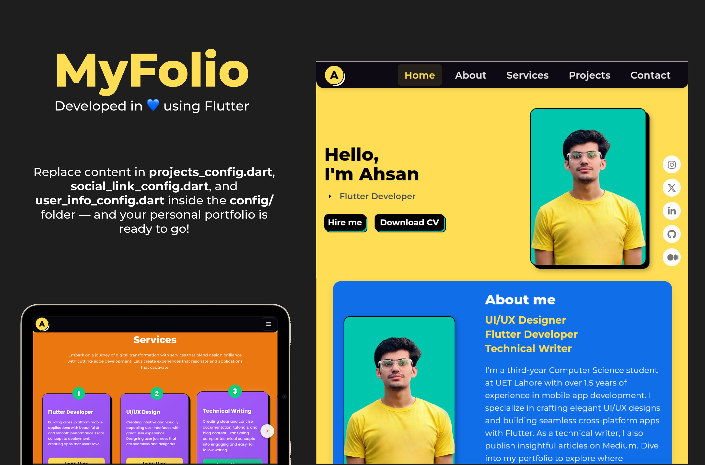

# 🧑‍💻 MyFolio - Flutter Portfolio App

A modern, minimalist, and highly customizable Flutter portfolio website/application to showcase your skills, projects, and professional journey. Designed for fast setup and easy editing—even if you're not a Flutter developer!

<div align="center">
   
[](https://flutter.dev)
[](https://dart.dev)
[](LICENSE)
</div>




<div align="center">
   
[](#)
[](https://github.com/ahsxndev/Portfolio/fork)
[](https://github.com/ahsxndev/Portfolio/issues)
[](https://github.com/ahsxndev/Portfolio/pulls)
</div>

---

## 🧑‍💻 MyFolio

A portfolio website for developers built using Flutter. Includes:

- Home
- About
- Services
- Projects (Portfolio)
- Contact

## ✨ Features

- 🖥️ Modern, clean, and minimalist UI
- 📱 Responsive for mobile, tablet, desktop, and web
- 💨 Smooth animations & transitions
- 🛠️ Easy to customize: just edit config files!
- 📦 Cross-platform: Android, iOS, Web, Windows, macOS, Linux
- ⚡ SEO optimized for web
- 🔗 Social media & email/WhatsApp integration
- 🧑‍💼 Business ready: contact forms, service detail modals, project showcase

## 🔗 Useful links

🌐 Website: https://ahsanzaman.dev  
📱 Android APK: [Direct Download](https://github.com/ahsxndev/Portfolio/releases/tag/v1.0.0/app-release.apk)  
🐙 GitHub: [ahsxndev/myfolio](https://github.com/ahsxndev/Portfolio)

## 🏗️ Quick Setup

1. **Clone the repository**
   ```bash
   git clone https://github.com/ahsxndev/Portfolio.git
   cd Portfolio
   ```

2. **Install dependencies**
   ```bash
   flutter pub get
   ```

3. **Run the app**
   ```bash
   flutter run
   ```

4. **Customize config files**
   - `lib/core/config/user_info_config.dart` — your info
   - `lib/core/config/projects_config.dart` — your projects
   - `lib/core/config/social_links_config.dart` — your socials

## ⚙️ Customization

- **Personal Info**: Edit your name, job title, email, phone in `user_info_config.dart`
- **Projects**: Add/edit projects in `projects_config.dart`
- **Social Links**: Update your social profiles in `social_links_config.dart`
- **Images**: Replace profile and project images in `assets/images/`

## ⚡ Deployment

- **Web**: `flutter build web --release`
- **Android**: `flutter build apk --release`
- **iOS**: `flutter build ios --release`

Deploy web app to GitHub Pages or Firebase Hosting easily!


## 📄 License

This project is licensed under the MIT License - see the [LICENSE](LICENSE) file for details.

## 🤝 Contributing

Pull requests, issues, and suggestions are welcome!  
Fork, star, and contribute your awesome ideas.

- [Contribute here!](https://github.com/ahsxndev/Portfolio/pulls)

---

## 🙏 Acknowledgments

- Flutter team
- Font Awesome
- Google Fonts
- All open-source contributors

## 👤 Author & Contact

<div align="center">

### **Ahsan Zaman**

[](https://github.com/ahsxndev)
[](https://linkedin.com/in/ahxanzaman)
[](mailto:ahsanzaman.dev@gmail.com)

---

### 🌟 **If you found this project helpful, please give it a star!** ⭐

Made with 💙 using Flutter
